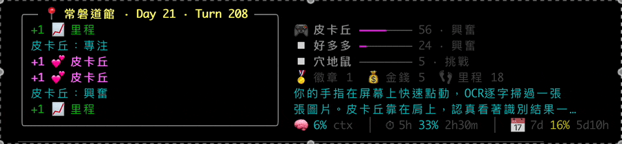
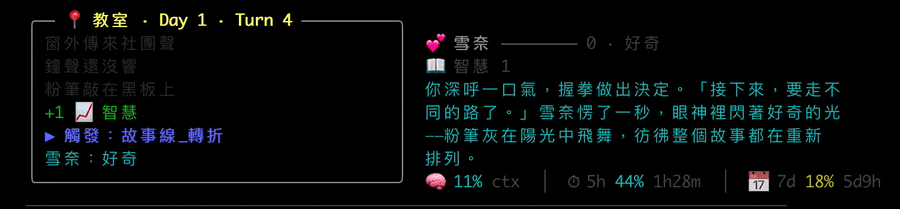
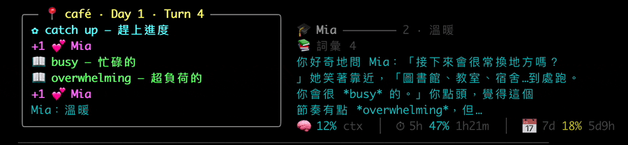

# ccmud

A prompt-driven text MUD that lives in your Claude Code status line. **Every prompt you send to Claude — debugging, writing code, opening PRs — secretly advances a story you're starring in.**

> 寫 code 還是痛苦，但至少會升級。

A background `claude -p --model haiku` reads your work prompt, transforms it metaphorically into in-fiction activity (debug → 念書、寫 code → 練字、開會 → 課堂討論), and writes the next 2-4 sentences plus typed events (好感+N、捕獲新寶可夢、收集英文單字⋯) that appear in the LCD frame above your status bar.

**Pure bash · JSON-pluggable genres · Free with Claude Pro/Max · macOS + Linux**

_Documentation primarily in 繁中. English README PRs welcome._

## Demos

### pokemon — 寶可夢冒險



<details>
<summary><b>dating-sim</b> — 戀愛養成（點開看）</summary>


</details>

<details>
<summary><b>english-learn</b> — 英語留學（點開看）</summary>


</details>

## Genres bundled

| id | 主題 | 主資源 | 玩家屬性 |
|---|---|---|---|
| `dating-sim` | 校園戀愛 | 角色好感 0-100 | 智慧 / 魅力 / 體力 |
| `pokemon` | 寶可夢訓練家 | 寶可夢等級 | 徽章 / 金錢 / 里程 |
| `english-learn` | 留學日常 | 親近度 0-100 | 詞彙 / 聽力 / 口說 |

切換完全無損：`mud.sh set-genre <id>` 自動 snapshot 當前進度，下次切回去完整還原。每個 genre 都有獨立存檔。

## Cost & privacy

**Cost — 訂閱用戶基本無感，連 Pro 都夠用。**

- 每個 turn 是**一次 Haiku 4.5 呼叫**（Anthropic 最便宜、最快的模型，比 Sonnet 大約便宜一個量級），平均 ~500 input + ~200 output token。
- 走的是你**已登入的 `claude` CLI session** — **不需要 API key、不需要 credit card**，直接吃你的 **Claude Pro / Max 訂閱**額度。沒訂閱也能跑（Free tier），但日打 prompt 量大會比較快撞限制。
- 量感：日常用 Claude Code 一天打 50-200 個 prompt → ccmud 累計 ~35K-140K Haiku token。跟你同一天 Sonnet / Opus 寫 code 的開銷比幾乎可以忽略。`mud.sh usage` 看每日累計數字。

**Privacy：**

- 你的 prompt body 截前 800 字會傳給背景 Haiku（劇情驅動材料）。要關掉：刪 `cmd_feed_prompt` 裡寫 `.last_prompt` 那行，或定期 `rm $TMPDIR/ccmud/*.last_prompt`。
- `state.json` / `story.log` / `usage.log` / `saves/` 都在本機 `~/.claude/mud/`，不外傳。

## Install

```bash
git clone https://github.com/richardvt/ccmud.git
cd ccmud
bash install.sh
```

The installer is interactive — **arrow keys** (↑/↓) + Enter, no typing required for genre / yes-no choices. It will:

- Detect existing save and ask if you want to keep it
- List bundled genres and let you pick one
- Copy `mud.sh` + all `genres/*.json` + `*.lib.sh` + `prompts/` to `~/.claude/mud/`
- Merge ccmud's `statusLine` + `UserPromptSubmit` + `Stop` hooks into `~/.claude/settings.json` (asks before replacing any existing statusLine)
- Install a `/mud` slash command for in-Claude-Code state inspection
- Render a sample LCD at the end

Idempotent. Re-run any time to pick up `mud.sh` updates. Existing saves preserved.

**👉 Restart Claude Code after installing** so the statusLine + hooks load.

**Requirements:** bash 4+, `jq`, `curl`, `claude` CLI on PATH (logged-in), Claude Code with statusLine + hooks support.

## How it works

```
你打 prompt
  └ UserPromptSubmit hook → mud.sh feed-prompt
      ├ turn += 1
      └ stash 你的 prompt body 到 $TMPDIR/ccmud/<sid>.last_prompt

(Claude 處理你的請求中…statusLine 每次刷新呼叫 mud.sh render
 — 重畫 LCD，不阻塞、不呼 Haiku)

Claude 結束 → Stop hook → mud.sh feed-stop
  ├ drain 上一輪的 Haiku cache（如有）
  │   ├ 抽 <<TAG>> 套用到 state（push events、改 affection、換 mood⋯）
  │   ├ 寫進 story.log（永久存檔）
  │   └ 設 last_narrative
  ├ 累計 token 用量到 usage.log
  └ 背景 fork claude -p --model haiku 寫下一輪劇情
       └ 寫到 <sid>.<genre>.next.txt（給下個 Stop hook drain）
```

**重要：劇情比你慢一回合。** 第一次打 prompt 看不到劇情變化（Haiku 還在背景寫，~60-180s）；下一個 prompt 觸發時，才會看到剛剛那一輪的劇情顯示出來。

## Prompt → 劇情映射

Haiku 把你的工作 prompt 隱喻轉換成遊戲世界活動。每個 genre 的對應方式不同：

| 你在做 | dating-sim | pokemon | english-learn |
|---|---|---|---|
| debug / 修 bug | 念書卡關 | 對戰思考 | 啃英文文獻 |
| 寫 code | 練字、寫信 | 訓練寶可夢 | 寫英文 essay |
| 寫 SQL / 查資料 | 翻舊書 | 看圖鑑 | library 找文獻 |
| 開會 / chat | 課堂討論 | 訓練家交流 | study group |
| 跑測試 | 模擬考 | 模擬對戰 | TOEFL practice |

詳細映射規則放在每個 `genres/<id>.json:system_prompt` 裡。

## Commands

```bash
~/.claude/mud/mud.sh preview              # 印一次 LCD 到 terminal
~/.claude/mud/mud.sh stats                # JSON 印當前 state
~/.claude/mud/mud.sh story                # 看劇情 log（最後 60 行）
~/.claude/mud/mud.sh story full           # 整份劇情史
~/.claude/mud/mud.sh story count          # 至今寫了幾個 turn
~/.claude/mud/mud.sh usage                # 每日 token 用量
~/.claude/mud/mud.sh hatch <name> [genre] # 開新存檔
~/.claude/mud/mud.sh set-genre <id>       # 切 genre（per-genre snapshot）
~/.claude/mud/mud.sh list-genres          # 列出可用 genre
~/.claude/mud/mud.sh debug-set <f> <v>    # 直接寫 state.json 欄位
~/.claude/mud/mud.sh update               # 抓 GitHub 最新版蓋過去
~/.claude/mud/mud.sh uninstall            # 移除 hook + 刪 binaries（保留 state + saves）
```

Hook entry points (Claude Code 自動呼叫，不要手動)：`feed-prompt` / `feed-stop` / `render`。

**`/mud` slash command**：在 Claude Code 內打 `/mud`，Claude 會跑 `mud.sh stats` + `preview` 並用人話 summarize 當前 state（焦點角色、好感、最近劇情）。免切 terminal。

## Tag DSL

每個 genre 共用以下 tag。Haiku 在敘述後面加 `<<TAG>>`，drain 時 mud.sh 套用到 state。

```
<<AFFECTION+3:雪奈>>     好感變化（±N，N=1~5）
<<MOOD:害羞:雪奈>>        心情字串
<<SCENE:咖啡廳>>          場景轉換
<<FOCUS:小薇>>            焦點角色
<<FLAG+:告白_未>>          設置劇情旗標
<<ITEM+:玫瑰>>             獲得物品
<<STAT+1:智慧>>            玩家屬性增減（key 須在 genre.stat_names）
<<NEW_CHAR:凜>>            新角色登場
<<ENDING:雪奈Good>>        終局
```

**Genre 可加自訂 tag** 透過 `genres/<id>.lib.sh` 定義 `genre_apply_tag` hook：

| Genre | 自訂 tag |
|---|---|
| `pokemon` | `<<CATCH:小火龍>>`、`<<HEAL:皮卡丘>>`、`<<FAINT:皮卡丘>>`、`<<BADGE:岩石徽章>>`、`<<EVOLVE:皮卡丘:雷丘>>` |
| `english-learn` | `<<WORD+:exhausted:筋疲力盡的>>`、`<<PHRASE+:break the ice:破冰>>` |

每個 tag 套用後也會自動 push 一行人話到 `events` ring buffer（例：`+3 💕 雪奈`、`📖 exhausted — 筋疲力盡的`）給 LCD 顯示。

**ENDING 之後**：LCD 切到結局畫面、`alive=false`、新 prompt 不再推進劇情。要繼續玩跑 `mud.sh hatch <name> [genre]` 開新存檔（同 genre 的話舊進度不留；換 genre 會自動 snapshot 舊存檔到 `saves/`）。

## Add your own genre

1. 寫一份 `genres/<id>.json`（schema 見 [`genres/README.md`](genres/README.md)）
2. 可選：寫 `genres/<id>.lib.sh` 定義 `genre_apply_tag` 跟 `genre_event_style`，加自訂 tag
3. `bash install.sh` 重裝（會 copy 新檔案）或直接 `cp` 到 `~/.claude/mud/genres/`
4. `mud.sh set-genre <id>`

範例參考：
- 純 JSON 換皮：[`genres/dating-sim.json`](genres/dating-sim.json)
- JSON + 自訂 tag handler：[`genres/pokemon.json`](genres/pokemon.json) + [`genres/pokemon.lib.sh`](genres/pokemon.lib.sh)

## Files

```
~/.claude/mud/
  ├─ mud.sh                       # 引擎
  ├─ state.json                   # 當前存檔（單一 active slot）
  ├─ saves/<genre>.json           # 每個 genre 的 snapshot（set-genre 自動寫）
  ├─ genres/
  │   ├─ <id>.json                # genre 設定
  │   └─ <id>.lib.sh              # 可選：genre 專屬 tag handler
  ├─ prompts/haiku-base.txt       # 所有 genre 共用的 system prompt 前綴
  ├─ usage.log                    # 每日 token 累計
  └─ story.log                    # 完整劇情史（append-only、跨 genre）
```

## Troubleshooting

**裝完看不到 LCD**：要重啟 Claude Code 才會 load 新的 statusLine + hooks。
**第一個 prompt 沒看到劇情變化**：drain 永遠晚一個 turn 是設計，打第二個 prompt 就會看到（[How it works](#how-it-works) 那段流程圖）。
**LCD 一直停在淡灰色 fallback 文字**：背景 `claude -p` 失敗。最常見原因：`claude` CLI 沒登入、quota 撞上限、PATH 沒抓到 `claude`。terminal 跑 `claude` 自己驗一次。
**LCD 內容亂跳 / 字寬奇怪**：你的 terminal 不是 utf-8 或 emoji 字寬計算錯。改用 iTerm2 / Ghostty / WezTerm。
**狀態列空一片**：你 Claude Code 版本太舊不支援 statusLine，升級到最新版。

## What it isn't

- 不會幫你寫 code、不會 review PR、不會自動化 dev 流程。它只是在背景講故事。
- 不會跨機器同步存檔（state.json 單機本地）。手動 sync `~/.claude/mud/` 到雲端可以解。
- 不在 Claude.ai web / Claude Desktop 跑。**只在 Claude Code（CLI）**，因為它需要 hook + statusLine。
- Windows native 沒測過（WSL 應該可以，沒驗證）。
- ENDING 觸發後遊戲停在結局畫面 — 想繼續要 `mud.sh hatch` 重開（這就是設計）。
- 三個 bundled genre 是中文 + 日系/日常設定。想要英文敘述、賽博龐克、武俠⋯ 自己寫 [genre](genres/README.md)。

## Uninstall

```bash
~/.claude/mud/mud.sh uninstall
```

從 `~/.claude/settings.json` 拔掉 ccmud 的 statusLine 跟 hooks，刪除 `mud.sh` / `genres/` / `prompts/` / `/mud` 指令。**保留** `state.json` / `story.log` / `usage.log` / `saves/` 以便將來再裝接續。

完全清光：`rm -rf ~/.claude/mud/`。

## Coexistence with other statusLine tools

只有一個 statusLine 槽位。`install.sh` 偵測到既有 statusLine 會詢問再覆寫。`UserPromptSubmit` / `Stop` hooks 用 append 合併（兩邊都會 fire）。Hook 之間有 `CCMUD_INTERNAL` env var guard 防止子 claude session 觸發遞迴。

## License

MIT.
